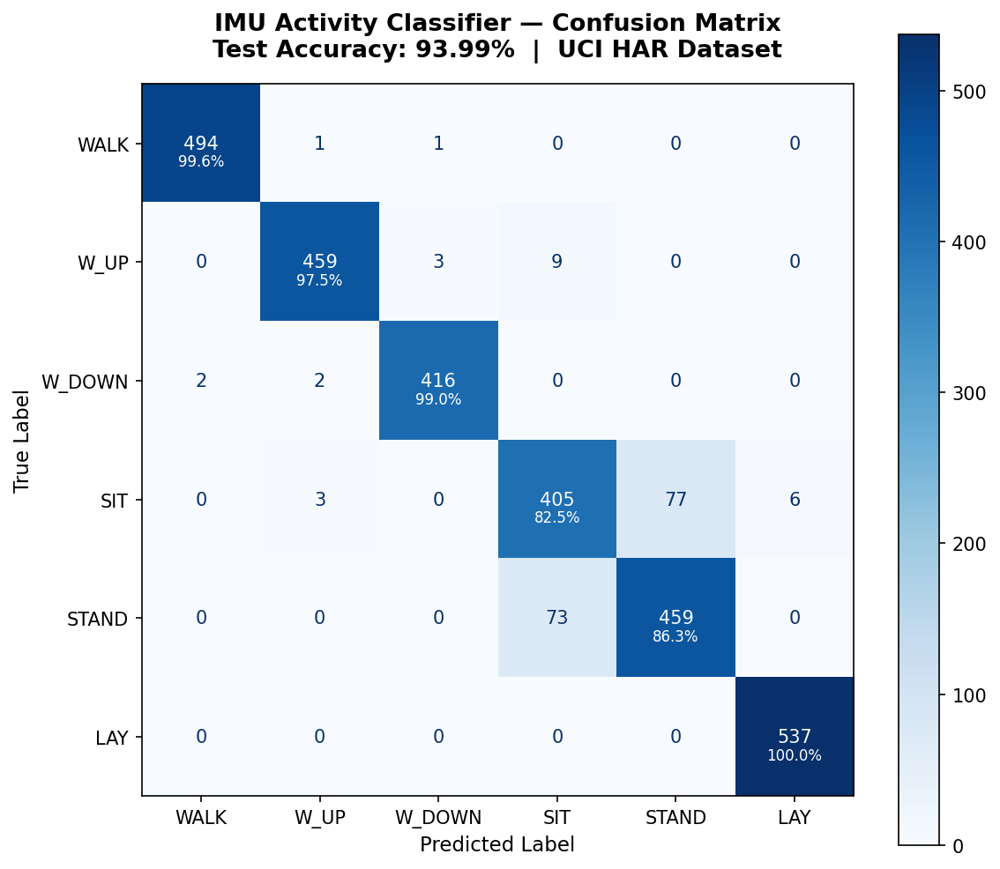
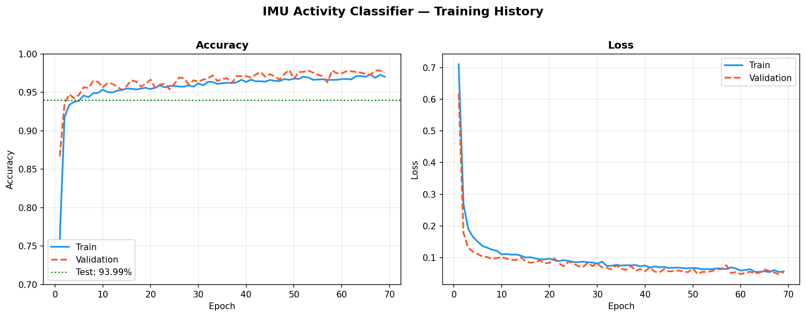
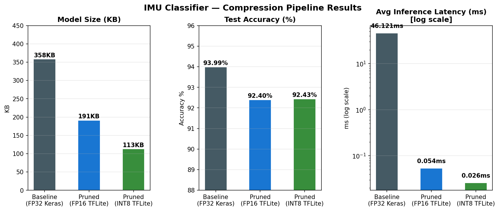

# IMU Activity Classifier — Pruning + Quantization for Edge Deployment

[](https://python.org)
[](https://tensorflow.org)
[](https://archive.ics.uci.edu/dataset/240/human+activity+recognition+using+smartphones)
[](https://huggingface.co/raj5517/imu-activity-classifier)

A compact 1D-CNN trained on the UCI HAR dataset for human activity recognition from 6-axis IMU signals (accelerometer + gyroscope). The model is compressed via **magnitude pruning (78% sparsity)** followed by **INT8 quantization**, achieving a **68% size reduction** and **1775x inference speedup** with only **1.56% accuracy loss**.

---

## Results

### Baseline vs Compressed

| Model | Size | Accuracy | Avg Latency |
|-------|------|----------|-------------|
| Baseline (FP32 Keras) | 358 KB | 93.99% | 46.1 ms |
| Pruned FP16 TFLite | 191 KB | 92.40% | 0.054 ms |
| **Pruned INT8 TFLite** | **113 KB** | **92.43%** | **0.026 ms** |

- **Size reduction:** 68.4% (358KB → 113KB)
- **Latency speedup:** 1775x (Keras single-sample → INT8 TFLite)
- **Accuracy drop:** 1.56%

### Per-Class Accuracy (Baseline)

| Class | Accuracy |
|-------|----------|
| WALKING | 99.6% |
| WALKING_UPSTAIRS | 97.5% |
| WALKING_DOWNSTAIRS | 99.0% |
| SITTING | 82.5% |
| STANDING | 86.3% |
| LAYING | 100.0% |

> SITTING/STANDING confusion is expected — both are static poses distinguishable only by torso angle. This pattern appears in all published UCI HAR results.

---

## Visualizations

### Confusion Matrix


### Training Curves


### Compression Pipeline Summary


---

## Architecture
```
Input: (128 timesteps × 9 channels)
  ↓ Conv1D(32, k=5) → BN → MaxPool → Dropout
  ↓ Conv1D(64, k=3) → BN → MaxPool → Dropout
  ↓ Conv1D(128, k=3) → BN → MaxPool → Dropout
  ↓ Conv1D(128, k=3) → BN
  ↓ GlobalAveragePooling1D
  ↓ Dense(64) → Dropout(0.3)
  ↓ Dense(6, softmax)

Total parameters: 91,718
FP32 size: 358 KB
```

**Design choices:**
- `GlobalAveragePooling` instead of `Flatten` — 16x fewer parameters in head
- `BatchNormalization` throughout — survives quantization better than LayerNorm
- No LSTM — CNN alone achieves 93.99% on UCI HAR with much lower latency

---

## Dataset

**UCI HAR Dataset** — 30 subjects, 6 activities, 50Hz sampling rate
- 7,352 training windows / 2,947 test windows
- Window size: 128 timesteps (2.56 seconds)
- 9 channels: body_acc (x/y/z), body_gyro (x/y/z), total_acc (x/y/z)
```bash
# Data is downloaded automatically
python data/prepare_data.py
```

---

## Compression Pipeline

### Stage 1 — Magnitude Pruning (78% sparsity)
Uses TensorFlow Model Optimization Toolkit with `PolynomialDecay` schedule:
- Starts at 0% sparsity, ramps to 80% over 30 epochs
- Fine-tunes at `lr=1e-5` to recover accuracy
- Result: 78% of weights zeroed, only 1.56% accuracy drop

### Stage 2 — INT8 Post-Training Quantization
- Converts FP32 weights → INT8 using 200 calibration samples
- Keeps float32 I/O for easy integration
- Result: 113KB deployable `.tflite` file
```bash
python prune_and_quantize.py
```

---

## Quickstart
```bash
git clone https://github.com/RAj5517/imu_activity_classifier.git
cd imu_activity_classifier
python -m venv venv && source venv/Scripts/activate
pip install -r requirements.txt

python data/prepare_data.py   # download + preprocess UCI HAR
python train.py               # train baseline (~2 min on CPU)
python prune_and_quantize.py  # compress: pruning + INT8
python benchmark.py           # measure latency + accuracy
python visualize.py           # generate plots
```

---

## Project Structure
```
imu_activity_classifier/
├── data/
│   └── prepare_data.py       ← auto-downloads UCI HAR
├── models/                   ← saved .keras and .tflite files
├── outputs/                  ← plots and visualizations
├── model.py                  ← CNN architecture
├── train.py                  ← training script
├── prune_and_quantize.py     ← compression pipeline
├── benchmark.py              ← latency + accuracy evaluation
├── visualize.py              ← confusion matrix + plots
└── requirements.txt
```

---

## HuggingFace

Models hosted at: [huggingface.co/raj5517/imu-activity-classifier](https://huggingface.co/raj5517/imu-activity-classifier)

Available files:
- `imu_baseline.keras` — full FP32 model
- `imu_pruned_fp16.tflite` — FP16 compressed
- `imu_pruned_int8.tflite` — INT8 compressed (recommended for deployment)